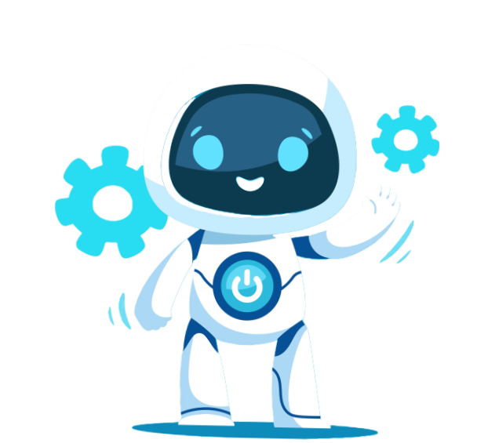

# MyBot Robotics - Educational Management Platform



A comprehensive educational management platform designed for **MyBot Robotics**. This project provides a robust solution for managing robotics courses, student registrations, and administrative tasks. It features a playful, kid-friendly landing page and a powerful administrative dashboard.

---

## 🚀 Overview

MyBot is a full-stack application built with modern web technologies. It bridges the gap between parents looking for quality robotics education for their children and the administrators who manage the courses and memberships.

### Key Components
- **Landing Page**: Highly interactive, SEO-optimized, and multi-language (EN/BG).
- **Application Portal**: Streamlined registration process for parents.
- **Admin Dashboard**: Comprehensive management of groups, members, parents, and applications.
- **RESTful API**: Secure and scalable backend built with .NET.

---

## ✨ Features

### Professional Landing Page
- **Dynamic Theme**: Playful design with falling blocks and smooth animations.
- **Responsive Layout**: Works seamlessly on mobile, tablet, and desktop.
- **Multi-language Support**: Full internationalization for English and Bulgarian.
- **Courses Overview**: Visual display of active robotics programs.

### Student & Parent Management
- **One-Click Application**: Simple form for parents to register multiple children.
- **Parent Portal**: Secure management of parent contact information.
- **Member Tracking**: Detailed tracking of student progress and status.

### Administrative Tools
- **Dashboard Analytics**: Overview of project status and recent activities.
- **Group Management**: Organize students into specific learning groups and locations.
- **Secure Access**: JWT-based authentication for administrative staff.

---

## 🛠 Technology Stack

### Backend (.NET API)
- **Framework**: .NET 8.0 Core
- **Database**: Entity Framework Core with SQL Server
- **Security**: JWT Authentication, CORS, HTTPS enforcement
- **Testing**: xUnit Tests
- **Containerization**: Docker support

### Frontend (React)
- **Framework**: React 19 + Vite
- **Styling**: Vanilla CSS with custom design system (Playful Kids Theme)
- **Animations**: Framer Motion
- **Navigation**: React Router 7
- **Internationalization**: i18next
- **State Management**: React Context API
- **Utilities**: Axios, Lucide React, React Hot Toast

---

## 🏗 Project Structure

```text
MyBot/
├── MyBotApi/               # Backend Solution
│   ├── MyBotApi/           # API Controllers and Configuration
│   ├── MyBotApi.Data/      # DbContext and Migrations
│   ├── MyBotApi.Models/    # DTOs and Database Models
│   ├── MyBotApi.Services/  # Business Logic
│   └── MyBotApi.Tests/     # Unit and Integration Tests
├── MyBotFrontEnd/          # Frontend Application
│   ├── public/             # Static assets (Favicon, .htaccess)
│   ├── src/
│   │   ├── assets/         # Images and Local Resources
│   │   ├── components/     # Reusable UI Components
│   │   ├── context/        # Auth and App Context
│   │   ├── locales/        # i18n JSON files
│   │   ├── pages/          # Page Components
│   │   └── utils/          # API helpers and utilities
│   └── vite.config.js
└── README.md
```

---

## 🏁 Getting Started

### Prerequisites
- .NET 8.0 SDK
- Node.js (v18+)
- SQL Server

### Backend Setup
1. Navigate to the API folder: `cd MyBotApi`
2. Update the connection string in `appsettings.json`.
3. Apply migrations: `dotnet ef database update`
4. Run the project: `dotnet run`

### Frontend Setup
1. Navigate to the frontend folder: `cd MyBotFrontEnd`
2. Install dependencies: `npm install`
3. Start development server: `npm run dev`
4. Build for production: `npm run build`

---

## 🌐 Deployment

### Superhosting.bg (cPanel)
The project is optimized for deployment on Apache-based hosting environments.

1. **Build**: Run `npm run build` to generate the `dist` folder.
2. **Configuration**: The `dist` folder includes a customized `.htaccess` file which:
   - Sets the RewriteBase.
   - Enforces **HTTPS/SSL** redirection.
   - Enables **SPA Routing** (redirects all requests to `index.html`).
3. **Upload**: Package the `dist` contents into a zip file and upload to the `public_html` directory via cPanel.

---

## 📄 License

This project is proprietary and intended for the internal use of **MyBot Robotics**.

---

*Made with ❤️ for the future innovators.*
